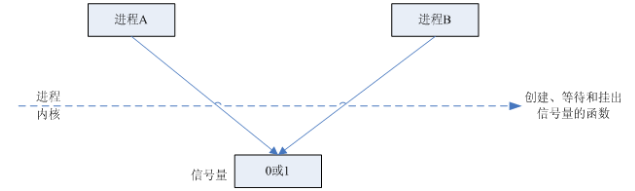

# 进程间通信IPC (InterProcess Communication)  
部分出自:[https://www.jianshu.com/p/c1015f5ffa74](https://www.jianshu.com/p/c1015f5ffa74)
## 进程间通信的概念

每个进程各自有不同的用户地址空间，任何一个进程的全局变量在另一个进程中都看不到，所以进程之间要交换数据必须通过内核，在内核中开辟一块缓冲区，进程1把数据从用户空间拷到内核缓冲区，进程2再从内核缓冲区把数据读走，内核提供的这种机制称为进程间通信（IPC，InterProcess Communication）  


## 进程间通信的7种方式
### 管道/匿名管道(pipe)

> 管道是半双工的，数据只能向一个方向流动；需要双方通信时，需要建立起两个管道。
只能用于父子进程或者兄弟进程之间(具有亲缘关系的进程);
单独构成一种独立的文件系统：管道对于管道两端的进程而言，就是一个文件，但它不是普通的文件，它不属于某种文件系统，而是自立门户，单独构成一种文件系统，并且只存在与内存中。
数据的读出和写入：一个进程向管道中写的内容被管道另一端的进程读出。写入的内容每次都添加在管道缓冲区的末尾，并且每次都是从缓冲区的头部读出数据。

  
**管道的实质：**
管道的实质是一个内核缓冲区，进程以先进先出的方式从缓冲区存取数据，管道一端的进程顺序的将数据写入缓冲区，另一端的进程则顺序的读出数据。
该缓冲区可以看做是一个循环队列，读和写的位置都是自动增长的，不能随意改变，一个数据只能被读一次，读出来以后在缓冲区就不复存在了。
当缓冲区读空或者写满时，有一定的规则控制相应的读进程或者写进程进入等待队列，当空的缓冲区有新数据写入或者满的缓冲区有数据读出来时，就唤醒等待队列中的进程继续读写。

**管道的局限：**
管道的主要局限性正体现在它的特点上：

> 只支持单向数据流；
只能用于具有亲缘关系的进程之间；
没有名字；
管道的缓冲区是有限的（管道制存在于内存中，在管道创建时，为缓冲区分配一个页面大小）；
管道所传送的是无格式字节流，这就要求管道的读出方和写入方必须事先约定好数据的格式，比如多少字节算作一个消息（或命令、或记录）等等；

### 有名管道(FIFO)
匿名管道，由于没有名字，只能用于亲缘关系的进程间通信。为了克服这个缺点，提出了有名管道(FIFO)。
有名管道不同于匿名管道之处在于它提供了一个路径名与之关联，以有名管道的文件形式存在于文件系统中，这样，即使与有名管道的创建进程不存在亲缘关系的进程，只要可以访问该路径，就能够彼此通过有名管道相互通信，因此，通过有名管道不相关的进程也能交换数据。值的注意的是，有名管道严格遵循先进先出(first in first out),对匿名管道及有名管道的读总是从开始处返回数据，对它们的写则把数据添加到末尾。它们不支持诸如lseek()等文件定位操作。有名管道的名字存在于文件系统中，内容存放在内存中。

	匿名管道和有名管道总结：
	（1）管道是特殊类型的文件，在满足先入先出的原则条件下可以进行读写，但不能进行定位读写。
	（2）匿名管道是单向的，只能在有亲缘关系的进程间通信；有名管道以磁盘文件的方式存在，可以实现本机任意两个进程通信。
	（3）无名管道阻塞问题：无名管道无需显示打开，创建时直接返回文件描述符，在读写时需要确定对方的存在，否则将退出。
	如果当前进程向无名管道的一端写数据，必须确定另一端有某一进程。如果写入无名管道的数据超过其最大值，写操作将阻塞，
	如果管道中没有数据，读操作将阻塞，如果管道发现另一端断开，将自动退出。
	（4）有名管道阻塞问题：有名管道在打开时需要确实对方的存在，否则将阻塞。即以读方式打开某管道，在此之前必须一个进程以写方式打开管道，
	否则阻塞。此外，可以以读写（O_RDWR）模式打开有名管道，即当前进程读，当前进程写，不会阻塞。


### 信号(Signal)
信号是Linux系统中用于进程间互相通信或者操作的一种机制，信号可以在任何时候发给某一进程，而无需知道该进程的状态。
如果该进程当前并未处于执行状态，则该信号就有内核保存起来，知道该进程回复执行并传递给它为止。
如果一个信号被进程设置为阻塞，则该信号的传递被延迟，直到其阻塞被取消是才被传递给进程。  

	Linux系统中常用信号：
	（1）SIGHUP：用户从终端注销，所有已启动进程都将收到该进程。系统缺省状态下对该信号的处理是终止进程。
	（2）SIGINT：程序终止信号。程序运行过程中，按Ctrl+C键将产生该信号。
	（3）SIGQUIT：程序退出信号。程序运行过程中，按Ctrl+\\键将产生该信号。
	（4）SIGBUS和SIGSEGV：进程访问非法地址。
	（5）SIGFPE：运算中出现致命错误，如除零操作、数据溢出等。
	（6）SIGKILL：用户终止进程执行信号。shell下执行kill -9发送该信号。
	（7）SIGTERM：结束进程信号。shell下执行kill 进程pid发送该信号。
	（8）SIGALRM：定时器信号。
	（9）SIGCLD：子进程退出信号。如果其父进程没有忽略该信号也没有处理该信号，则子进程退出后将形成僵尸进程。

**信号来源**

信号是软件层次上对中断机制的一种模拟，是一种异步通信方式，，信号可以在用户空间进程和内核之间直接交互，内核可以利用信号来通知用户空间的进程发生了哪些系统事件，信号事件主要有两个来源：

> 硬件来源：用户按键输入Ctrl+C退出、硬件异常如无效的存储访问等。
软件终止：终止进程信号、其他进程调用kill函数、软件异常产生信号。

**信号生命周期和处理流程**

	（1）信号被某个进程产生，并设置此信号传递的对象（一般为对应进程的pid），然后传递给操作系统；
	（2）操作系统根据接收进程的设置（是否阻塞）而选择性的发送给接收者，如果接收者阻塞该信号（且该信号是可以阻塞的），
	操作系统将暂时保留该信号，而不传递，直到该进程解除了对此信号的阻塞（如果对应进程已经退出，则丢弃此信号），
	如果对应进程没有阻塞，操作系统将传递此信号。
	（3）目的进程接收到此信号后，将根据当前进程对此信号设置的预处理方式，暂时终止当前代码的执行，保护上下文（主要包括临时寄存器数据，
	当前程序位置以及当前CPU的状态）、转而执行中断服务程序，执行完成后在回复到中断的位置。当然，对于抢占式内核，在中断返回时还将引发新的调度。


### 消息(Message)队列

消息队列是存放在内核中的消息链表，每个消息队列由消息队列标识符表示。
与管道（无名管道：只存在于内存中的文件；命名管道：存在于实际的磁盘介质或者文件系统）不同的是消息队列存放在内核中，只有在内核重启(即，操作系统重启)或者显示地删除一个消息队列时，该消息队列才会被真正的删除。
另外与管道不同的是，消息队列在某个进程往一个队列写入消息之前，并不需要另外某个进程在该队列上等待消息的到达。
> （1）消息队列是消息的链表,具有特定的格式,存放在内存中并由消息队列标识符标识.  
（2）消息队列允许一个或多个进程向它写入与读取消息.  
（3）管道和消息队列的通信数据都是先进先出的原则。  
（4）消息队列可以实现消息的随机查询,消息不一定要以先进先出的次序读取,也可以按消息的类型读取.比FIFO更有优势。  
（5）消息队列克服了信号承载信息量少，管道只能承载无格式字 节流以及缓冲区大小受限等缺。  
（6）目前主要有两种类型的消息队列：POSIX消息队列以及System V消息队列，系统V消息队列目前被大量使用。系统V消息队列是随内核持续的，只有在内核重起或者人工删除时，该消息队列才会被删除。  

### 共享内存(share memory)

使得多个进程可以可以直接读写同一块内存空间，是最快的可用IPC形式。是针对其他通信机制运行效率较低而设计的。
为了在多个进程间交换信息，内核专门留出了一块内存区，可以由需要访问的进程将其映射到自己的私有地址空间。进程就可以直接读写这一块内存而不需要进行数据的拷贝，从而大大提高效率。
由于多个进程共享一段内存，因此需要依靠某种同步机制（如信号量）来达到进程间的同步及互斥。  


### 信号量(semaphore)
信号量是一个计数器，用于多进程对共享数据的访问，信号量的意图在于进程间同步。
为了获得共享资源，进程需要执行下列操作：  
>（1）创建一个信号量：这要求调用者指定初始值，对于二值信号量来说，它通常是1，也可是0。  
（2）等待一个信号量：该操作会测试这个信号量的值，如果小于0，就阻塞。也称为P操作。  
（3）挂出一个信号量：该操作将信号量的值加1，也称为V操作。  

为了正确地实现信号量，信号量值的测试及减1操作应当是原子操作。为此，信号量通常是在内核中实现的。Linux环境中，有三种类型：**Posix（可移植性操作系统接口）有名信号量（使用Posix IPC名字标识）、Posix基于内存的信号量（存放在共享内存区中）、System V信号量（在内核中维护）**。这三种信号量都可用于进程间或线程间的同步。



> 信号量与普通整型变量的区别：  
（1）信号量是非负整型变量，除了初始化之外，它只能通过两个标准原子操作：wait(semap) , signal(semap) ; 来进行访问；  
（2）操作也被成为PV原语（P来源于荷兰语proberen"测试"，V来源于荷兰语verhogen"增加"，P表示通过的意思，V表示释放的意思），而普通整型变量则可以在任何语句块中被访问；  

> 信号量与互斥量之间的区别：  
（1）互斥量用于线程的互斥，信号量用于线程的同步。这是互斥量和信号量的根本区别，也就是互斥和同步之间的区别。  
**互斥：**是指某一资源同时只允许一个访问者对其进行访问，具有唯一性和排它性。但互斥无法限制访问者对资源的访问顺序，即访问是无序的。  
**同步：**是指在互斥的基础上（大多数情况），通过其它机制实现访问者对资源的有序访问。  
在大多数情况下，同步已经实现了互斥，特别是所有写入资源的情况必定是互斥的。少数情况是指可以允许多个访问者同时访问资源  
（2）互斥量值只能为0/1，信号量值可以为非负整数。
也就是说，一个互斥量只能用于一个资源的互斥访问，它不能实现多个资源的多线程互斥问题。信号量可以实现多个同类资源的多线程互斥和同步。当信号量为单值信号量是，也可以完成一个资源的互斥访问。
（3）互斥量的加锁和解锁必须由同一线程分别对应使用，信号量可以由一个线程释放，另一个线程得到。

### 套接字(socket)
套接字是一种通信机制，凭借这种机制，客户/服务器（即要进行通信的进程）系统的开发工作既可以在本地单机上进行，也可以跨网络进行。也就是说它可以让不在同一台计算机但通过网络连接计算机上的进程进行通信。  
  
套接字是支持TCP/IP的网络通信的基本操作单元，可以看做是不同主机之间的进程进行双向通信的端点，简单的说就是通信的两方的一种约定，用套接字中的相关函数来完成通信过程。

**套接字特性**  
套接字的特性由3个属性确定，它们分别是：域、端口号、协议类型。  
（1）套接字的域  
它指定套接字通信中使用的网络介质，最常见的套接字域有两种：
一是**AF_INET，它指的是Internet网络**。当客户使用套接字进行跨网络的连接时，它就需要用到服务器计算机的IP地址和端口来指定一台联网机器上的某个特定服务，所以在使用socket作为通信的终点，服务器应用程序必须在开始通信之前绑定一个端口，服务器在指定的端口等待客户的连接。
**另一个域AF_UNIX，表示UNIX文件系统**，它就是文件输入/输出，而它的地址就是文件名。  
（2）套接字的端口号  
每一个基于TCP/IP网络通讯的程序(进程)都被赋予了唯一的端口和端口号，端口是一个信息缓冲区，用于保留Socket中的输入/输出信息，端口号是一个16位无符号整数，范围是0-65535，以区别主机上的每一个程序（端口号就像房屋中的房间号），低于256的端口号保留给标准应用程序，比如pop3的端口号就是110，每一个套接字都组合进了IP地址、端口，这样形成的整体就可以区别每一个套接字。  
（3）套接字协议类型  
因特网提供三种通信机制，
**一是流套接字**，流套接字在域中通过TCP/IP连接实现，同时也是AF_UNIX中常用的套接字类型。流套接字提供的是一个有序、可靠、双向字节流的连接，因此发送的数据可以确保不会丢失、重复或乱序到达，而且它还有一定的出错后重新发送的机制。  
**二个是数据报套接字**，它不需要建立连接和维持一个连接，它们在域中通常是通过UDP/IP协议实现的。它对可以发送的数据的长度有限制，数据报作为一个单独的网络消息被传输,它可能会丢失、复制或错乱到达，UDP不是一个可靠的协议，但是它的速度比较高，因为它并一需要总是要建立和维持一个连接。  
**三是原始套接字**，原始套接字允许对较低层次的协议直接访问，比如IP、 ICMP协议，它常用于检验新的协议实现，或者访问现有服务中配置的新设备，因为RAW SOCKET可以自如地控制Windows下的多种协议，能够对网络底层的传输机制进行控制，所以可以应用原始套接字来操纵网络层和传输层应用。比如，我们可以通过RAW SOCKET来接收发向本机的ICMP、IGMP协议包，或者接收TCP/IP栈不能够处理的IP包，也可以用来发送一些自定包头或自定协议的IP包。网络监听技术很大程度上依赖于SOCKET_RAW。  

> 原始套接字与标准套接字的区别在于：
原始套接字可以读写内核没有处理的IP数据包，而流套接字只能读取TCP协议的数据，数据报套接字只能读取UDP协议的数据。因此，如果要访问其他协议发送数据必须使用原始套接字。  

套接字通信的建立  
  
Socket通信基本流程  

**服务器端**
（1）首先服务器应用程序用系统调用socket来创建一个套接字，它是系统分配给该服务器进程的类似文件描述符的资源，它不能与其他的进程共享。
（2）然后，服务器进程会给套接字起个名字，我们使用系统调用bind来给套接字命名。然后服务器进程就开始等待客户连接到这个套接字。
（3）接下来，系统调用listen来创建一个队列并将其用于存放来自客户的进入连接。
（4）最后，服务器通过系统调用accept来接受客户的连接。它会创建一个与原有的命名套接不同的新套接字，这个套接字只用于与这个特定客户端进行通信，而命名套接字（即原先的套接字）则被保留下来继续处理来自其他客户的连接（建立客户端和服务端的用于通信的流，进行通信）。

**客户端**
（1）客户应用程序首先调用socket来创建一个未命名的套接字，然后将服务器的命名套接字作为一个地址来调用connect与服务器建立连接。
（2）一旦连接建立，我们就可以像使用底层的文件描述符那样用套接字来实现双向数据的通信（通过流进行数据传输）

## 进程间通信实例
### 管道(pipe)
**管道的创建：**
``` c
#include <unistd.h>
int pipe(int fd[2]);
```
管道两端可分别用描述字fd[0]以及fd[1]来描述，需要注意的是，管道的两端是固定了任务的。即一端只能用于读，由描述字fd[0]表示，称其为管道读端；另一端则只能用于写，由描述字fd[1]来表示，称其为管道写端。如果试图从管道写端读取数据，或者向管道读端写入数据都将导致错误发生。一般文件的I/O函数都可以用于管道，如close、read、write等等。

> **从管道中读取数据：**
 如果管道的写端不存在，则认为已经读到了数据的末尾，读函数返回的读出字节数为0；
当管道的写端存在时，如果请求的字节数目大于PIPE_BUF，则返回管道中现有的数据字节数，如果请求的字节数目不大于PIPE_BUF，则返回管道中现有数据字节数（此时，管道中数据量小于请求的数据量）；或者返回请求的字节数（此时，管道中数据量不小于请求的数据量）。
**向管道中写入数据：**
向管道中写入数据时，linux将不保证写入的原子性，管道缓冲区一有空闲区域，写进程就会试图向管道写入数据。如果读进程不读走管道缓冲区中的数据，那么写操作将一直阻塞。 

``` c
#include <unistd.h>
#include <sys/types.h>
#include <errno.h>
main(int argc,char**argv)
{
    int pipe_fd[2];
    pid_t pid;
    char r_buf[4096];
    char w_buf[4096*2];
    int writenum;
    int rnum;
    memset(r_buf,0,sizeof(r_buf));  
    if(pipe(pipe_fd)<0)
    {
        printf("pipe create error\n");
        return -1;
    }
     
    if((pid=fork())==0)
    {
        close(pipe_fd[1]);
        while(1)
        {
        sleep(1);   
        rnum=read(pipe_fd[0],r_buf,1000);
        printf("child: readnum is %d\n",rnum);
        }
        close(pipe_fd[0]);
         
        exit();
    }
    else if(pid>0)
    {
    close(pipe_fd[0]);//write
    memset(r_buf,0,sizeof(r_buf));  
    if((writenum=write(pipe_fd[1],w_buf,1024))==-1)
        printf("write to pipe error\n");
    else    
        printf("the bytes write to pipe is %d \n", writenum);
    writenum=write(pipe_fd[1],w_buf,4096);
    close(pipe_fd[1]);
    }   
}
输出结果：
the bytes write to pipe 1000
the bytes write to pipe 1000  //注意，此行输出说明了写入的非原子性
the bytes write to pipe 1000
the bytes write to pipe 1000
the bytes write to pipe 1000
the bytes write to pipe 120  //注意，此行输出说明了写入的非原子性
the bytes write to pipe 0
the bytes write to pipe 0
......
```
### 有名管道(FIFO)

**有名管道的创建**
``` c
#include <sys/types.h>
#include <sys/stat.h>
int mkfifo(const char * pathname, mode_t mode)
```
``` shell
mkfifo pathname
```
有名管道的打开规则
有名管道比管道多了一个打开操作：open。

**FIFO的打开规则：**

> 如果当前打开操作是为读而打开FIFO时，若已经有相应进程为写而打开该FIFO，则当前打开操作将成功返回；否则，可能阻塞直到有相应进程为写而打开该FIFO（当前打开操作设置了阻塞标志）；或者，成功返回（当前打开操作没有设置阻塞标志）。

> 如果当前打开操作是为写而打开FIFO时，如果已经有相应进程为读而打开该FIFO，则当前打开操作将成功返回；否则，可能阻塞直到有相应进程为读而打开该FIFO（当前打开操作设置了阻塞标志）；或者，返回ENXIO错误（当前打开操作没有设置阻塞标志）。

**有名管道的读写规则**
从FIFO中读取数据：

约定：如果一个进程为了从FIFO中读取数据而阻塞打开FIFO，那么称该进程内的读操作为设置了阻塞标志的读操作。

向FIFO中写入数据：

约定：如果一个进程为了向FIFO中写入数据而阻塞打开FIFO，那么称该进程内的写操作为设置了阻塞标志的写操作。

命名管道有阻塞标志的设定。

程序1：写FIFO的程序
``` c
#include <sys/types.h>
#include <sys/stat.h>
#include <errno.h>
#include <fcntl.h>
#define FIFO_SERVER "/tmp/fifoserver"
main(int argc,char** argv)
//参数为即将写入的字节数
{
    int fd;
    char w_buf[4096*2];
    int real_wnum;
    memset(w_buf,0,4096*2);
    if((mkfifo(FIFO_SERVER,O_CREAT|O_EXCL)<0)&&(errno!=EEXIST))
        printf("cannot create fifoserver\n");
    if(fd==-1)
        if(errno==ENXIO)
            printf("open error; no reading process\n");
         
        fd=open(FIFO_SERVER,O_WRONLY|O_NONBLOCK,0);
    //设置非阻塞标志
    //fd=open(FIFO_SERVER,O_WRONLY,0);
    //设置阻塞标志
    real_wnum=write(fd,w_buf,2048);
    if(real_wnum==-1)
    {
        if(errno==EAGAIN)
            printf("write to fifo error; try later\n");
    }
    else 
        printf("real write num is %d\n",real_wnum);
    real_wnum=write(fd,w_buf,5000);
    //5000用于测试写入字节大于4096时的非原子性
    //real_wnum=write(fd,w_buf,4096);
    //4096用于测试写入字节不大于4096时的原子性
     
    if(real_wnum==-1)
        if(errno==EAGAIN)
            printf("try later\n");
}
```
程序2：与程序1一起测试写FIFO的规则，第一个命令行参数是请求从FIFO读出的字节数
``` c
#include <sys/types.h>
#include <sys/stat.h>
#include <errno.h>
#include <fcntl.h>
#define FIFO_SERVER "/tmp/fifoserver"
main(int argc,char** argv)
{
    char r_buf[4096*2];
    int  fd;
    int  r_size;
    int  ret_size;
    r_size=atoi(argv[1]);
    printf("requred real read bytes %d\n",r_size);
    memset(r_buf,0,sizeof(r_buf));
    fd=open(FIFO_SERVER,O_RDONLY|O_NONBLOCK,0);
    //fd=open(FIFO_SERVER,O_RDONLY,0);
    //在此处可以把读程序编译成两个不同版本：阻塞版本及非阻塞版本
    if(fd==-1)
    {
        printf("open %s for read error\n");
        exit(); 
    }
    while(1)
    {
         
        memset(r_buf,0,sizeof(r_buf));
        ret_size=read(fd,r_buf,r_size);
        if(ret_size==-1)
            if(errno==EAGAIN)
                printf("no data avlaible\n");
        printf("real read bytes %d\n",ret_size);
        sleep(1);
    }   
    pause();
    unlink(FIFO_SERVER);
}
```
### 信号
[https://www.ibm.com/developerworks/cn/linux/l-ipc/part2/index1.html](https://www.ibm.com/developerworks/cn/linux/l-ipc/part2/index1.html)
[https://www.ibm.com/developerworks/cn/linux/l-ipc/part2/index2.html](https://www.ibm.com/developerworks/cn/linux/l-ipc/part2/index2.html)

---

linux下的信号应用并没有想象的那么恐怖，程序员所要做的最多只有三件事情：

>* 安装信号（推荐使用sigaction()）；
>* 实现三参数信号处理函数，handler(int signal,struct siginfo *info, void *)；
>* 发送信号，推荐使用sigqueue()。

实际上，对有些信号来说，只要安装信号就足够了（信号处理方式采用缺省或忽略）。其他可能要做的无非是与信号集相关的几种操作。

1、signal() 
#include <signal.h> 
``` c
void (*signal(int signum, void (*handler))(int)))(int); 
// 如果该函数原型不容易理解的话，可以参考下面的分解方式来理解： 
typedef void (*sighandler_t)(int)； 
sighandler_t signal(int signum, sighandler_t handler));
```
第一个参数指定信号的值，第二个参数指定针对前面信号值的处理，可以忽略该信号（参数设为SIG_IGN）；可以采用系统默认方式处理信号(参数设为SIG_DFL)；也可以自己实现处理方式(参数指定一个函数地址)。 
如果signal()调用成功，返回最后一次为安装信号signum而调用signal()时的handler值；失败则返回SIG_ERR。

2、sigaction() 
``` c
#include <signal.h> 
int sigaction(int signum,const struct sigaction *act,struct sigaction *oldact));
```
sigaction函数用于改变进程接收到特定信号后的行为。该函数的第一个参数为信号的值，可以为除SIGKILL及SIGSTOP外的任何一个特定有效的信号（为这两个信号定义自己的处理函数，将导致信号安装错误）。第二个参数是指向结构sigaction的一个实例的指针，在结构sigaction的实例中，指定了对特定信号的处理，可以为空，进程会以缺省方式对信号处理；第三个参数oldact指向的对象用来保存原来对相应信号的处理，可指定oldact为NULL。如果把第二、第三个参数都设为NULL，那么该函数可用于检查信号的有效性。

第二个参数最为重要，其中包含了对指定信号的处理、信号所传递的信息、信号处理函数执行过程中应屏蔽掉哪些函数等等。

sigaction结构定义如下：
``` c
struct sigaction {
         union{
           __sighandler_t _sa_handler;
           void (*_sa_sigaction)(int,struct siginfo *, void *)；
           }_u
                    sigset_t sa_mask；
                   unsigned long sa_flags； 
                 void (*sa_restorer)(void)；
                 }
```
其中，sa_restorer，已过时，POSIX不支持它，不应再被使用。
**实例一：信号发送及处理**
实现一个信号接收程序sigreceive（其中信号安装由sigaction（））。
``` c
#include <signal.h>
#include <sys/types.h>
#include <unistd.h>
void new_op(int,siginfo_t*,void*);
int main(int argc,char**argv)
{
    struct sigaction act;   
    int sig;
    sig=atoi(argv[1]);
     
    sigemptyset(&act.sa_mask);
    act.sa_flags=SA_SIGINFO;
    act.sa_sigaction=new_op;
     
    if(sigaction(sig,&act,NULL) < 0)
    {
        printf("install sigal error\n");
    }
     
    while(1)
    {
        sleep(2);
        printf("wait for the signal\n");
    }
}
void new_op(int signum,siginfo_t *info,void *myact)
{
    printf("receive signal %d", signum);
    sleep(5);
}
```
说明，命令行参数为信号值，后台运行sigreceive signo &，可获得该进程的ID，假设为pid，然后再另一终端上运行kill -s signo pid验证信号的发送接收及处理。同时，可验证信号的排队问题。 
注：可以用sigqueue实现一个命令行信号发送程序sigqueuesend，见 附录1。

**实例二：信号传递附加信息**
主要包括两个实例：

向进程本身发送信号，并传递指针参数；
``` c
#include <signal.h>
#include <sys/types.h>
#include <unistd.h>
void new_op(int,siginfo_t*,void*);
int main(int argc,char**argv)
{
    struct sigaction act;   
    union sigval mysigval;
    int i;
    int sig;
    pid_t pid;      
    char data[10];
    memset(data,0,sizeof(data));
    for(i=0;i < 5;i++)
        data[i]='2';
    mysigval.sival_ptr=data;
     
    sig=atoi(argv[1]);
    pid=getpid();
     
    sigemptyset(&act.sa_mask);
    act.sa_sigaction=new_op;//三参数信号处理函数
    act.sa_flags=SA_SIGINFO;//信息传递开关
    if(sigaction(sig,&act,NULL) < 0)
    {
        printf("install sigal error\n");
    }
    while(1)
    {
        sleep(2);
        printf("wait for the signal\n");
        sigqueue(pid,sig,mysigval);//向本进程发送信号，并传递附加信息
    }
}
void new_op(int signum,siginfo_t *info,void *myact)//三参数信号处理函数的实现
{
    int i;
    for(i=0;i<10;i++)
    {
        printf("%c\n ",(*( (char*)((*info).si_ptr)+i)));
    }
    printf("handle signal %d over;",signum);
}
```
这个例子中，信号实现了附加信息的传递，信号究竟如何对这些信息进行处理则取决于具体的应用。

2、	不同进程间传递整型参数：把1中的信号发送和接收放在两个程序中，并且在发送过程中传递整型参数。 
信号接收程序：
``` c
#include <signal.h>
#include <sys/types.h>
#include <unistd.h>
void new_op(int,siginfo_t*,void*);
int main(int argc,char**argv)
{
    struct sigaction act;
    int sig;
    pid_t pid;      
     
    pid=getpid();
    sig=atoi(argv[1]);  
     
    sigemptyset(&act.sa_mask);
    act.sa_sigaction=new_op;
    act.sa_flags=SA_SIGINFO;
    if(sigaction(sig,&act,NULL)<0)
    {
        printf("install sigal error\n");
    }
    while(1)
    {
        sleep(2);
        printf("wait for the signal\n");
    }
}
void new_op(int signum,siginfo_t *info,void *myact)
{
    printf("the int value is %d \n",info->si_int);
}
```
信号发送程序：命令行第二个参数为信号值，第三个参数为接收进程ID。
``` c
#include <signal.h>
#include <sys/time.h>
#include <unistd.h>
#include <sys/types.h>
main(int argc,char**argv)
{
    pid_t pid;
    int signum;
    union sigval mysigval;
    signum=atoi(argv[1]);
    pid=(pid_t)atoi(argv[2]);
    mysigval.sival_int=8;//不代表具体含义，只用于说明问题
    if(sigqueue(pid,signum,mysigval)==-1)
        printf("send error\n");
    sleep(2);
}
```
注：**实例2的两个例子侧重点在于用信号来传递信息**，目前关于在linux下通过信号传递信息的实例非常少，倒是Unix下有一些，但传递的基本上都是关于传递一个整数，传递指针的我还没看到。我一直没有实现不同进程间的指针传递（实际上更有意义），也许在实现方法上存在问题吧，请实现者email我。

**实例三：信号阻塞及信号集操作**
``` c
#include "signal.h"
#include "unistd.h"
static void my_op(int);
main()
{
    sigset_t new_mask,old_mask,pending_mask;
    struct sigaction act;
    sigemptyset(&act.sa_mask);
    act.sa_flags=SA_SIGINFO;
    act.sa_sigaction=(void*)my_op;
    if(sigaction(SIGRTMIN+10,&act,NULL))
        printf("install signal SIGRTMIN+10 error\n");
    sigemptyset(&new_mask);
    sigaddset(&new_mask,SIGRTMIN+10);
    if(sigprocmask(SIG_BLOCK, &new_mask,&old_mask))
        printf("block signal SIGRTMIN+10 error\n");
    sleep(10);  
    printf("now begin to get pending mask and unblock SIGRTMIN+10\n");
    if(sigpending(&pending_mask)<0)
        printf("get pending mask error\n");
    if(sigismember(&pending_mask,SIGRTMIN+10))
        printf("signal SIGRTMIN+10 is pending\n");
    if(sigprocmask(SIG_SETMASK,&old_mask,NULL)<0)
        printf("unblock signal error\n");
    printf("signal unblocked\n");
    sleep(10);
}
static void my_op(int signum)
{
    printf("receive signal %d \n",signum);
}
```
编译该程序，并以后台方式运行。在另一终端向该进程发送信号(运行kill -s 42 pid，SIGRTMIN+10为42)，查看结果可以看出几个关键函数的运行机制，信号集相关操作比较简单。

注：在上面几个实例中，使用了printf()函数，只是作为诊断工具，pringf()函数是不可重入的，不应在信号处理函数中使用。

## 消息队列(报文队列)

[https://www.ibm.com/developerworks/cn/linux/l-ipc/part3/index.html](https://www.ibm.com/developerworks/cn/linux/l-ipc/part3/index.html)

---

**对消息队列的操作无非有下面三种类型：**  
1、 打开或创建消息队列 
消息队列的内核持续性要求每个消息队列都在系统范围内对应唯一的键值，所以，要获得一个消息队列的描述字，只需提供该消息队列的键值即可；

注：消息队列描述字是由在系统范围内唯一的键值生成的，而键值可以看作对应系统内的一条路经。  

2、 读写操作

消息读写操作非常简单，对开发人员来说，每个消息都类似如下的数据结构：  
``` c
struct msgbuf{
long mtype;
char mtext[1];
};
```
mtype成员代表消息类型，从消息队列中读取消息的一个重要依据就是消息的类型；mtext是消息内容，当然长度不一定为1。因此，对于发送消息来说，首先预置一个msgbuf缓冲区并写入消息类型和内容，调用相应的发送函数即可；对读取消息来说，首先分配这样一个msgbuf缓冲区，然后把消息读入该缓冲区即可。
3、 获得或设置消息队列属性：

消息队列的信息基本上都保存在消息队列头中，因此，可以分配一个类似于消息队列头的结构(struct msqid_ds)来返回消息队列的属性；同样可以设置该数据结构。

**linux为操作系统V进程间通信的三种方式（消息队列、信号灯、共享内存区)** 提供了一个统一的用户界面：
``` c
int ipc(unsigned int call, int first, int second, int third, void * ptr, long fifth);
第一个参数指明对IPC对象的操作方式，对消息队列而言共有四种操作：MSGSND、MSGRCV、MSGGET以及MSGCTL，分别代表向消息队列发送消息、从消息队列读取消息、打开或创建消息队列、控制消息队列；first参数代表唯一的IPC对象；下面将介绍四种操作。

int ipc( MSGGET, intfirst, intsecond, intthird, void*ptr, longfifth);
与该操作对应的系统V调用为：int msgget( (key_t)first，second)。

int ipc( MSGCTL, intfirst, intsecond, intthird, void*ptr, longfifth)
与该操作对应的系统V调用为：int msgctl( first，second, (struct msqid_ds*) ptr)。

int ipc( MSGSND, intfirst, intsecond, intthird, void*ptr, longfifth); 
与该操作对应的系统V调用为：int msgsnd( first, (struct msgbuf*)ptr, second, third)。

int ipc( MSGRCV, intfirst, intsecond, intthird, void*ptr, longfifth); 
与该操作对应的系统V调用为：int msgrcv( first，(struct msgbuf*)ptr, second, fifth,third)，
```
注：本人不主张采用系统调用ipc()，而更倾向于采用系统V或者POSIX进程间通信API。原因如下：
> 虽然该系统调用提供了统一的用户界面，但正是由于这个特性，它的参数几乎不能给出特定的实际意义（如以first、second来命名参数），在一定程度上造成开发不便。
正如ipc手册所说的：ipc()是linux所特有的，编写程序时应注意程序的移植性问题；
该系统调用的实现不过是把系统V IPC函数进行了封装，没有任何效率上的优势；
系统V在IPC方面的API数量不多，形式也较简洁。

消息队列应用相对较简单，下面实例基本上覆盖了对消息队列的所有操作，同时，程序输出结果有助于加深对前面所讲的某些规则及消息队列限制的理解。
``` c
#include <sys/types.h>
#include <sys/msg.h>
#include <unistd.h>
void msg_stat(int,struct msqid_ds );
main()
{
int gflags,sflags,rflags;
key_t key;
int msgid;
int reval;
struct msgsbuf{
        int mtype;
        char mtext[1];
    }msg_sbuf;
struct msgmbuf
    {
    int mtype;
    char mtext[10];
    }msg_rbuf;
struct msqid_ds msg_ginfo,msg_sinfo;
char* msgpath="/unix/msgqueue";
key=ftok(msgpath,'a');
gflags=IPC_CREAT|IPC_EXCL;
msgid=msgget(key,gflags|00666);
if(msgid==-1)
{
    printf("msg create error\n");
    return;
}
//创建一个消息队列后，输出消息队列缺省属性
msg_stat(msgid,msg_ginfo);
sflags=IPC_NOWAIT;
msg_sbuf.mtype=10;
msg_sbuf.mtext[0]='a';
reval=msgsnd(msgid,&msg_sbuf,sizeof(msg_sbuf.mtext),sflags);
if(reval==-1)
{
    printf("message send error\n");
}
//发送一个消息后，输出消息队列属性
msg_stat(msgid,msg_ginfo);
rflags=IPC_NOWAIT|MSG_NOERROR;
reval=msgrcv(msgid,&msg_rbuf,4,10,rflags);
if(reval==-1)
    printf("read msg error\n");
else
    printf("read from msg queue %d bytes\n",reval);
//从消息队列中读出消息后，输出消息队列属性
msg_stat(msgid,msg_ginfo);
msg_sinfo.msg_perm.uid=8;//just a try
msg_sinfo.msg_perm.gid=8;//
msg_sinfo.msg_qbytes=16388;
//此处验证超级用户可以更改消息队列的缺省msg_qbytes
//注意这里设置的值大于缺省值
reval=msgctl(msgid,IPC_SET,&msg_sinfo);
if(reval==-1)
{
    printf("msg set info error\n");
    return;
}
msg_stat(msgid,msg_ginfo);
//验证设置消息队列属性
reval=msgctl(msgid,IPC_RMID,NULL);//删除消息队列
if(reval==-1)
{
    printf("unlink msg queue error\n");
    return;
}
}
void msg_stat(int msgid,struct msqid_ds msg_info)
{
int reval;
sleep(1);//只是为了后面输出时间的方便
reval=msgctl(msgid,IPC_STAT,&msg_info);
if(reval==-1)
{
    printf("get msg info error\n");
    return;
}
printf("\n");
printf("current number of bytes on queue is %d\n",msg_info.msg_cbytes);
printf("number of messages in queue is %d\n",msg_info.msg_qnum);
printf("max number of bytes on queue is %d\n",msg_info.msg_qbytes);
//每个消息队列的容量（字节数）都有限制MSGMNB，值的大小因系统而异。在创建新的消息队列时，//msg_qbytes的缺省值就是MSGMNB
printf("pid of last msgsnd is %d\n",msg_info.msg_lspid);
printf("pid of last msgrcv is %d\n",msg_info.msg_lrpid);
printf("last msgsnd time is %s", ctime(&(msg_info.msg_stime)));
printf("last msgrcv time is %s", ctime(&(msg_info.msg_rtime)));
printf("last change time is %s", ctime(&(msg_info.msg_ctime)));
printf("msg uid is %d\n",msg_info.msg_perm.uid);
printf("msg gid is %d\n",msg_info.msg_perm.gid);
}
```
### 共享内存

[https://www.ibm.com/developerworks/cn/linux/l-ipc/part5/index1.html](https://www.ibm.com/developerworks/cn/linux/l-ipc/part5/index1.html)
有点完全看不懂

---

这是IBM的一个实例：
**范例1：两个进程通过映射普通文件实现共享内存通信**
范例1包含两个子程序：map_normalfile1.c及map_normalfile2.c。编译两个程序，可执行文件分别为map_normalfile1及map_normalfile2。两个程序通过命令行参数指定同一个文件来实现共享内存方式的进程间通信。map_normalfile2试图打开命令行参数指定的一个普通文件，把该文件映射到进程的地址空间，并对映射后的地址空间进行写操作。map_normalfile1把命令行参数指定的文件映射到进程地址空间，然后对映射后的地址空间执行读操作。这样，两个进程通过命令行参数指定同一个文件来实现共享内存方式的进程间通信。

下面是两个程序代码：
``` c
/*-------------map_normalfile1.c-----------*/
#include <sys/mman.h>
#include <sys/types.h>
#include <fcntl.h>
#include <unistd.h>
typedef struct{
  char name[4];
  int  age;
}people;
main(int argc, char** argv) // map a normal file as shared mem:
{
  int fd,i;
  people *p_map;
  char temp;
   
  fd=open(argv[1],O_CREAT|O_RDWR|O_TRUNC,00777);
  lseek(fd,sizeof(people)*5-1,SEEK_SET);
  write(fd,"",1);
   
  p_map = (people*) mmap( NULL,sizeof(people)*10,PROT_READ|PROT_WRITE,
        MAP_SHARED,fd,0 );
  close( fd );
  temp = 'a';
  for(i=0; i<10; i++)
  {
    temp += 1;
    memcpy( ( *(p_map+i) ).name, &temp,2 );
    ( *(p_map+i) ).age = 20+i;
  }
  printf(" initialize over \n ")；
  sleep(10);
  munmap( p_map, sizeof(people)*10 );
  printf( "umap ok \n" );
}
/*-------------map_normalfile2.c-----------*/
#include <sys/mman.h>
#include <sys/types.h>
#include <fcntl.h>
#include <unistd.h>
typedef struct{
  char name[4];
  int  age;
}people;
main(int argc, char** argv)  // map a normal file as shared mem:
{
  int fd,i;
  people *p_map;
  fd=open( argv[1],O_CREAT|O_RDWR,00777 );
  p_map = (people*)mmap(NULL,sizeof(people)*10,PROT_READ|PROT_WRITE,
       MAP_SHARED,fd,0);
  for(i = 0;i<10;i++)
  {
  printf( "name: %s age %d;\n",(*(p_map+i)).name, (*(p_map+i)).age );
  }
  munmap( p_map,sizeof(people)*10 );
}
```
**范例2：父子进程通过匿名映射实现共享内存**
``` c
#include <sys/mman.h>
#include <sys/types.h>
#include <fcntl.h>
#include <unistd.h>
typedef struct{
  char name[4];
  int  age;
}people;
main(int argc, char** argv)
{
  int i;
  people *p_map;
  char temp;
  p_map=(people*)mmap(NULL,sizeof(people)*10,PROT_READ|PROT_WRITE,
       MAP_SHARED|MAP_ANONYMOUS,-1,0);
  if(fork() == 0)
  {
    sleep(2);
    for(i = 0;i<5;i++)
      printf("child read: the %d people's age is %d\n",i+1,(*(p_map+i)).age);
    (*p_map).age = 100;
    munmap(p_map,sizeof(people)*10); //实际上，进程终止时，会自动解除映射。
    exit();
  }
  temp = 'a';
  for(i = 0;i<5;i++)
  {
    temp += 1;
    memcpy((*(p_map+i)).name, &temp,2);
    (*(p_map+i)).age=20+i;
  }
  sleep(5);
  printf( "parent read: the first people,s age is %d\n",(*p_map).age );
  printf("umap\n");
  munmap( p_map,sizeof(people)*10 );
  printf( "umap ok\n" );
}

// 考察程序的输出结果，体会父子进程匿名共享内存：
child read: the 1 people's age is 20
child read: the 2 people's age is 21
child read: the 3 people's age is 22
child read: the 4 people's age is 23
child read: the 5 people's age is 24
parent read: the first people,s age is 100
umap
umap ok
```

**另一种 shmget**
1.创建共享内存shmget
``` c
原型：int shmget(key_t key, size_t size, int shmflg)

返回值:　创建成功，则返回一个非负整数，即共享内存标识；

 　　　　　　如果失败，则返回-1.

参数：
　　key:    //程序需要提供一个参数key，它为共享内存段提供一个外部名。（每个IPC对象都与一个键 即key相关联，然后此键再由内核变换为标识符）。还有一个特殊的键值IPC_PRIVATE, 它用于创建一个只属于该创建进程的新共享内存，通常不会用到；
　　
　　size: 　 //以字节为单位指定需要共享的内存容量。
 
　　shmflag: //包含9个比特的权限标志，它们的作用与创建文件时使用的mode标志是一样。由IPC_CREAT定义的一个特殊比特位，同时必须和权限标志按位或才能创建一个新的共享内存段。
（注意：若想创建的新IPC结构没有引用具有同一标识符的现有的IPC结构，就要同时指定IPC_CREAT 和 IPC_EXCL；共享内存属IPC中一种，它同样如此）
```
注:
　　权限标志对共享内存非常有用，因为它允许一个进程创建的共享内存可以被共享内存的创建者所拥有的进程写入，同时其它用户创建的进程只能读取共享内存。我们可以利用这个功能来提供一种有效的对数据进行只读访问的方法，通过将数据放共享内存并设置它的权限，就可以避免数据被其他用户修改。
 
 2.将共享内存端挂载到自己地址空间shmat
　　
第一次创建共享内存段时，它不能被任何进程访问。要想启动对该内存的访问，必须将其连接到一个进程的地址空间
``` c
该函数原型：void *shmat(int shmid, const void *shmaddr, int shmflg)　

　　返回值：调用成功返回挂载的虚拟地址空间起始地址，失败返回NULL

参数：
　　int shmid            //是由shmget函数返回的共享内存标识。

	const void *shmaddr  //指定共享内存连接到当前进程中的地址位置，通常为0，表示让系统来选择共享内存的地址。

	int shmflg　　　　　//是一组标志位，通常为0。它还可取:SHM_RND,用以决定是否将当前共享内存段连接到指定的shmaddr上。
							//该参数和shm_addr联合使用，用来控制共享内存连接的地址，除非只计划在一种硬件上运行应用程序，否则不要这样指定。填0让操作系统自己选择是更好的方式。

　　SHM_RDONLY单独使用则是指让它使连接的内存段只读，否则以读写方式连接此内存段
```

 

　　　　　　　　　　　　
3. 与共享内存段分离 shmdt　
``` c
原型：int shmdt(const void *shmaddr)

参数：

　　shm_addr: shmat返回的地址指针。
 
　　成功时，返回0，
　　失败时，返回-1.
 
NOTE:
 
　　仅仅是共享内存分离但并未删除它，其标识符及其相关数据结构都在；直到某个进程的IPC_RMID命令的调用shmctl特地删除它为止　　
　　只是使得该共享内存对当前进程不再可用。
```

4. shmctl 共享内存控制函数
``` c
#include <sys/ipc.h>
#include <sys/shm.h>

原型： int shmctl(int shmid, int cmd, struct shmid_ds *buf)
参数：　
　　shm_id : 是shmget返回的共享内存标识符。
　　cmd: 它可以取3个值:
　　　　IPC_STAT  把shmid_ds结构中的数据设置为共享内存的当前关联值
　　　　IPC_SET   如果进程有足够的权限就把共享内存的当前关联值设置为shmid_ds结构中给出的值
　　　　IPC_RMID  删除共享内存段
　　buf:是一个指针，包含共享内存模式和访问权限的结构。
　　buf指向的shmid_ds结构体 一定要包含下列一些参数：
    struct shmid_ds {  
      uid_t shm_perm.uid;  
      uid_t shm_perm.gid;  
      mode_t shm_perm.mode;  
    }  
```
**简单使用**
``` c
//write.c 
#include <stdio.h>
#include <stdlib.h>
#include <unistd.h>
#include <string.h>
#include <sys/ipc.h>
#include <sys/shm.h>
typedef struct Stu
{ 
    int age;
    char name[10];
}Stu;

int main( void)
{ 
    Stu s;
    strcpy(s.name, "jack");
    //创建共享内存段
    int id = shmget(1234, 8, IPC_CREAT|0644);
    if( id == -1)perror( " shmget"),exit( 1);
    //挂载到进程的地址空间
    Stu* p = ( Stu*)shmat( id, NULL, 0);

    int i =0;
    while( 1)
    {    
        s.age = i++;
        memcpy(p, &s, sizeof(Stu));  //写到共享段中
        sleep( 2);
    }
    return 0;
} 

//read.c
#include <stdio.h>
#include <stdlib.h>
#include <unistd.h>
#include <sys/ipc.h>
#include <sys/shm.h>
typedef struct Stu
{ 
    int age;
    char name[10];
}Stu;
int main( void)
{ 
    int id = shmget(1234, 8, 0);
    if( id == -1)perror( " shmget"),exit( 1);

    Stu* p = ( Stu*)shmat( id, NULL, 0);
    while( 1)
    {    
        printf(" age= %d, name= %s\n", p->age, p->name);
        sleep(2);
    }
    return 0;
}  
```

