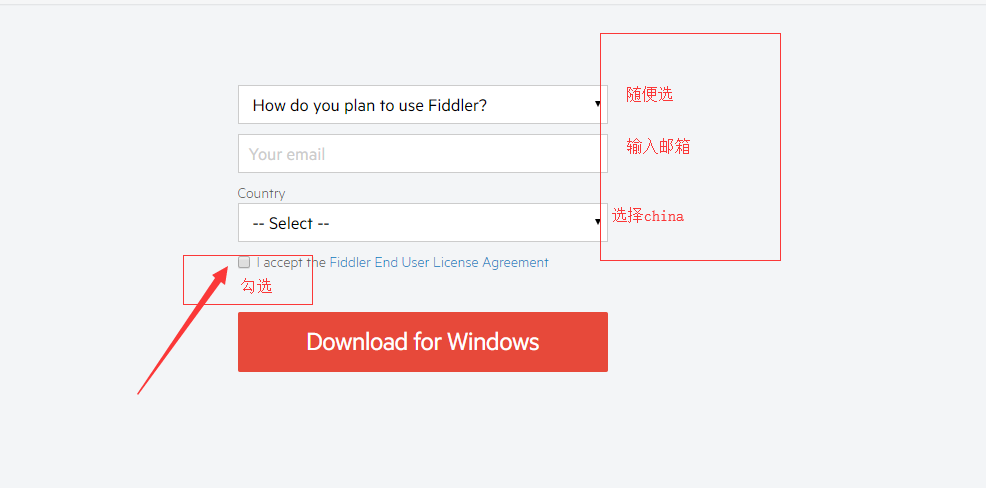
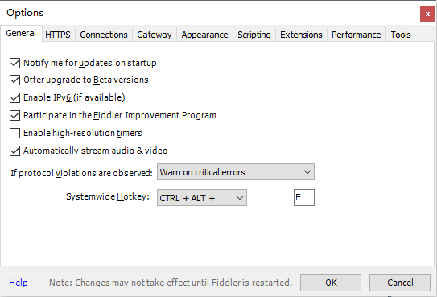
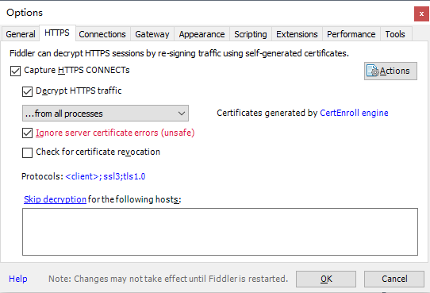
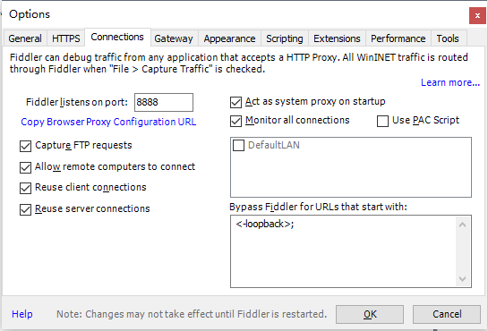
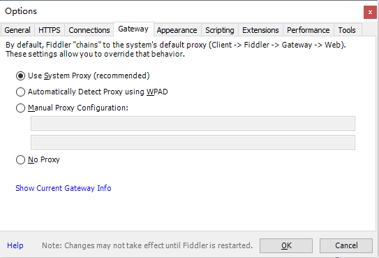
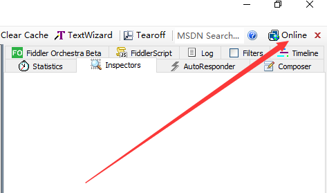
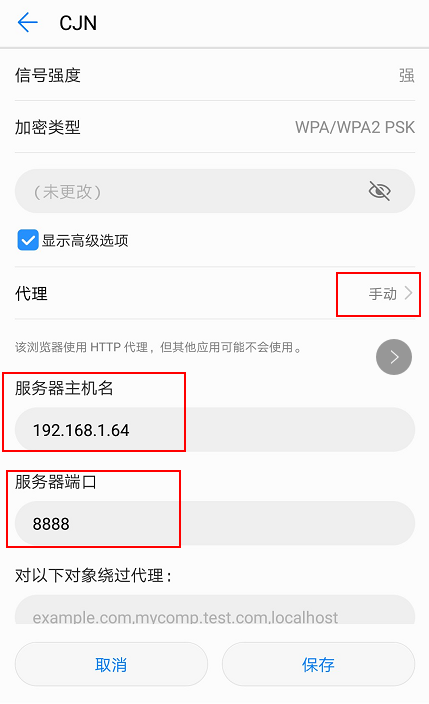
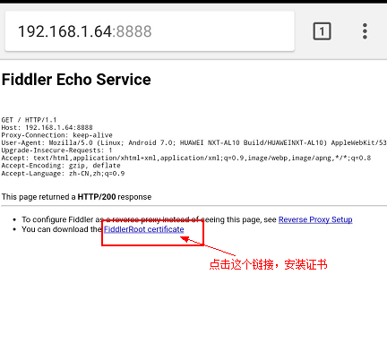

# fiddler抓APP无线https配置

## fiddler下载
::: danger 一定要去官网下载
  [官方网址](https://www.telerik.com/download/fiddler)  
  安装在fiddler默认安装路径！！！
:::

然后一路默认安装下去。
## fiddler配置HTTPS
1. 打开Fiddler，点击Tools->Options，跟随如下设置，其中会弹出证书信任，信任就好:

  
  点击OK后，配置HTTPS部分结束。
::: warning 手机无法下载证书？
1. 重启fiddler或者重启电脑
2. 关闭电脑防火墙
:::
## 手机设置及证书下载
>手机连接到电脑的wifi (设置wifi代理为手动，输入代理服务器主机名(例：192.168.1.64)和代理服务器端口(例：8888))

通过fiddler页面Online可以查看服务器IP(例：192.168.1.64)
  
### Android手机安装证书方法
1. 连接到对应的wifi然后设置 **手动** 代理  
  
2. 通过Chrome或者自带浏览器登录代理服务器(192.168.1.64:8888)点击下载证书

:::tip
证书是一一对应的，更换手机/PC/IP都要重装证书
:::
